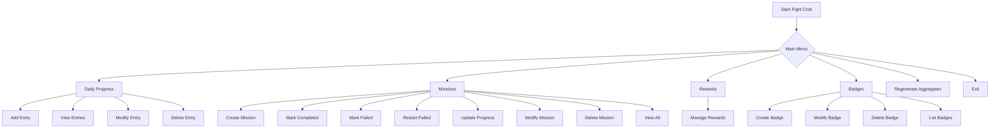
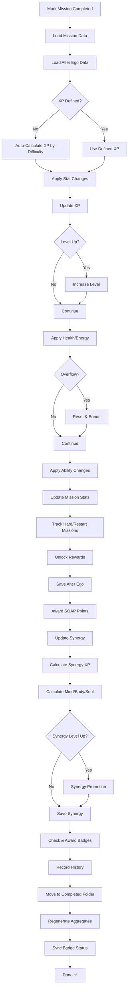
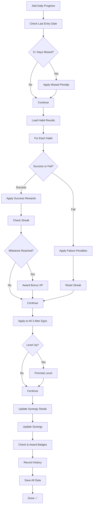
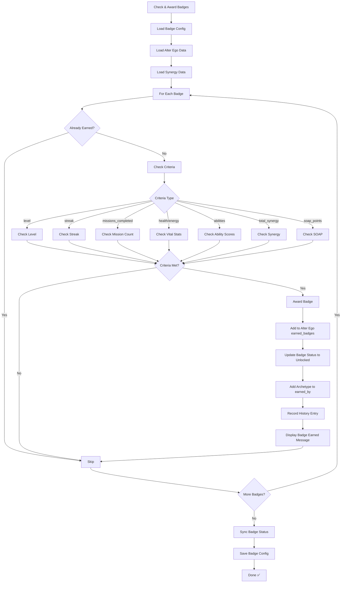
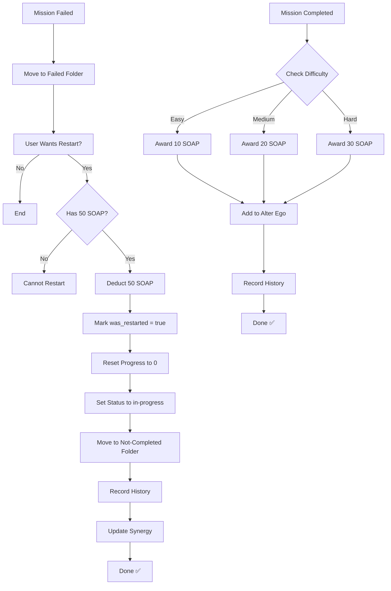
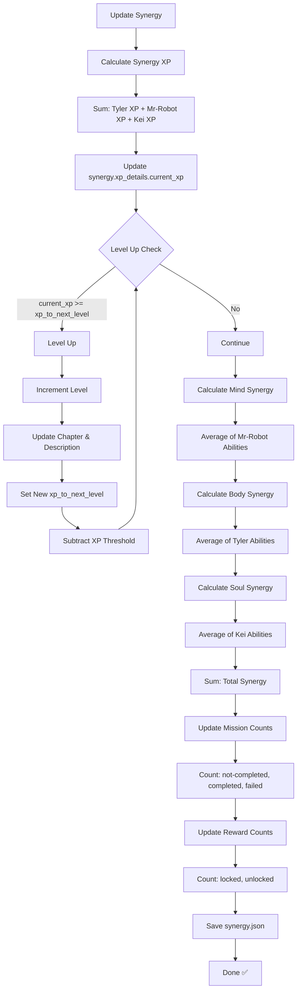
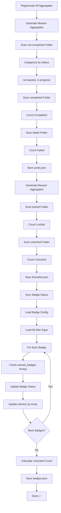

# Fight Club Gamification System - Complete Guide

## 📋 Table of Contents
1. [System Overview](#system-overview)
2. [Architecture & File Structure](#architecture--file-structure)
3. [Core Concepts](#core-concepts)
4. [Configuration Files](#configuration-files)
5. [Data Flow Diagrams](#data-flow-diagrams)
6. [Feature Workflows](#feature-workflows)
7. [API Integration](#api-integration)

---

## System Overview

The Fight Club Gamification System is a comprehensive personal development tracking platform that gamifies progress across three alter-ego archetypes: **Tyler Durden** (Body), **Mr. Robot** (Mind), and **Kei** (Soul).

### Key Components
- **Alter Egos**: Three character personas with unique abilities and stat tracking
- **Missions**: Goal-oriented tasks with progress tracking and rewards
- **Rewards**: Unlockable achievements tied to mission completion
- **Badges**: Achievement system with 35 badges across 10 categories
- **Daily Progress**: Habit tracking with streak management
- **SOAP Points**: Currency earned from restarting failed missions
- **Synergy**: Combined power level from all alter-egos

---

## Architecture & File Structure

```
daily-progress/
├── scripts/
│   ├── fight-club.py          # Main management script (3500+ lines)
│   ├── manager.py              # Additional utilities
│   └── update_badges_structure.py
│
├── gamification/
│   ├── alter-egoes/
│   │   ├── tyler.json         # Tyler Durden stats & progress
│   │   ├── mr-robot.json      # Mr. Robot stats & progress
│   │   └── kei.json           # Kei stats & progress
│   │
│   ├── configs/
│   │   ├── badges.json        # Badge definitions (35 badges, status tracking)
│   │   ├── daily-progress-rules.json  # Habit rules & penalties
│   │   ├── synergy-rules.json # Synergy level progression
│   │   └── xp-rules.json      # XP & level-up rules
│   │
│   ├── missions/
│   │   ├── not-completed/     # Active & not-started missions
│   │   ├── completed/         # Successfully completed missions
│   │   └── failed/            # Failed missions (can be restarted)
│   │
│   ├── rewards/
│   │   ├── locked/            # Unrevealed rewards
│   │   └── unlocked/          # Claimed rewards
│   │
│   ├── history.json           # Complete event history log
│   ├── synergy.json           # Combined stats from all alter-egos
│   ├── posts.json             # Mission aggregates (active/completed/failed)
│   └── themelist.json         # Reward aggregates (locked/unlocked)
│
└── cron@daily/                # Daily progress entries by date
    └── YYYY/MM/DD-Month-YYYY.json
```

---

## Core Concepts

### 1. Alter Egos

Each alter-ego represents a facet of personal development:

| Alter Ego | Archetype | Focus | Synergy Type | Key Abilities |
|-----------|-----------|-------|--------------|---------------|
| **Tyler Durden** | Body/Chaos | Physical & Primal | Body | Strength, Discipline, Aggression, Confidence, Dominance, Pain Tolerance, Honor, Determination |
| **Mr. Robot** | Mind/Code | Intellectual & Technical | Mind | Intelligence, Logic, Adaptability, Innovation, Focus, Systemization, Precision, Speed |
| **Kei** | Soul/Calm | Spiritual & Emotional | Soul | Compassion, Empathy, Inner Peace, Clarity, Resilience, Patience, Wisdom, Harmony |

**Alter Ego JSON Structure:**
```json
{
  "name": "Tyler Durden",
  "nickname": "Ty",
  "level": 1,
  "title": "Awakened",
  "status": {
    "current_status": "active|disabled",
    "note": "Status reason"
  },
  "soap_points": 0,
  "earned_badges": [],
  "stats": {
    "missions_completed": 0,
    "hard_missions_completed": 0,
    "restarted_missions_completed": 0,
    "rewards_unlocked": 0
  },
  "xp_details": {
    "current_xp": 0,
    "xp_to_next_level": 100
  },
  "health_details": {
    "current_health": 100,
    "max_health": 100
  },
  "energy_details": {
    "current_energy": 100,
    "max_energy": 100
  },
  "abilities": {
    "ability_name": 0
  }
}
```

### 2. Missions

Missions are goal-oriented tasks assigned to specific alter-egos.

**Mission Lifecycle:**
```
not-started → in-progress → completed ✅
                ↓
              failed ❌ → restart (SOAP) → in-progress
```

**Mission JSON Structure:**
```json
{
  "archetype": "tyler|mr-robot|kei",
  "mission_code": "T01",
  "title": "Mission Title",
  "description": "Mission description",
  "difficulty": "easy|medium|hard",
  "status": "not-started|in-progress|completed|failed",
  "progress": {
    "current": 0,
    "total": 30
  },
  "archetype_stat_change": {
    "on_complete": {
      "xp": 50,
      "health": 10,
      "energy": 10,
      "abilities": {
        "strength": 5,
        "discipline": 25
      }
    },
    "on_failure": {
      "xp": 0,
      "health": -10,
      "energy": -10,
      "abilities": {
        "strength": -5,
        "discipline": -25
      }
    }
  },
  "reward": [
    {
      "reward_id": "R01",
      "reward_type": "street|vanguard|legendary|apex|mythic",
      "title": "Reward Title"
    }
  ],
  "mission_icon": "assets/badges/default.png",
  "due_date": "2025-12-31",
  "start_date": "2025-11-22",
  "completion_date": null,
  "was_restarted": false
}
```

**XP Rewards by Difficulty:**
- **Easy**: 50 XP (auto-calculated if not defined)
- **Medium**: 100 XP
- **Hard**: 200 XP

### 3. Rewards

Rewards are unlockable items tied to mission completion.

**Reward Rarity Tiers:**
- 🟢 **Street**: Common rewards
- 🔵 **Vanguard**: Uncommon rewards
- 🟣 **Legendary**: Rare rewards
- 🟠 **Apex**: Epic rewards
- 🔴 **Mythic**: Legendary rewards

**Reward JSON Structure:**
```json
{
  "reward_id": "R01",
  "title": "Reward Title",
  "description": "Reward description",
  "associated_mission_ids": ["T01", "M02"],
  "reward_type": "street|vanguard|legendary|apex|mythic",
  "is_locked": true,
  "badge_icon": "assets/rewards/default.png"
}
```

### 4. Badges

35 achievement badges across 10 categories with 5 rarity levels.

**Badge Categories:**
- 🎯 **Progression**: Level milestones
- 🔥 **Streaks**: Daily check-in streaks
- ⚔️ **Missions**: Mission completion counts
- 📊 **Stats**: Health/Energy thresholds
- 💪 **Abilities**: Ability score achievements
- 🔗 **Synergy**: Total synergy milestones
- 💎 **SOAP**: SOAP point accumulation
- 🎁 **Rewards**: Reward unlocking
- 🔄 **Redemption**: Restart & complete failed missions

**Badge Rarity Levels:**
- ⚪ **Common**: Basic achievements
- 🟢 **Uncommon**: Moderate challenges
- 🔵 **Rare**: Significant milestones
- 🟣 **Epic**: Major accomplishments
- 🟡 **Legendary**: Ultimate achievements

**Badge JSON Structure (in configs/badges.json):**
```json
{
  "badge_id": "B001",
  "name": "First Steps",
  "description": "Reach level 5",
  "rarity": "common|uncommon|rare|epic|legendary",
  "category": "progression|streaks|missions|stats|abilities|synergy|soap|rewards|redemption",
  "status": "locked|unlocked",
  "earned_by": [
    {
      "archetype": "tyler",
      "earned_date": "2025-11-22"
    }
  ],
  "criteria": {
    "type": "level|streak|missions_completed|health|energy|any_ability|all_abilities|total_synergy|soap_points|hard_missions_completed|restarted_missions_completed|rewards_unlocked",
    "value": 5
  }
}
```

### 5. SOAP System

**SOAP (Second Opportunity After Penalty)** points allow restarting failed missions.

**SOAP Rewards:**
- Easy mission completion: 10 SOAP
- Medium mission completion: 20 SOAP
- Hard mission completion: 30 SOAP

**SOAP Costs:**
- Restart failed mission: 50 SOAP

### 6. Synergy System

Synergy represents the combined power of all alter-egos.

**Synergy Calculation:**
```
Mind Synergy = Average of Mr. Robot's abilities
Body Synergy = Average of Tyler's abilities
Soul Synergy = Average of Kei's abilities
Total Synergy = Mind + Body + Soul

Synergy XP = Tyler XP + Mr. Robot XP + Kei XP
```

**Synergy JSON Structure:**
```json
{
  "fight_club": {
    "level": 1,
    "chapter": "THE AWAKENING",
    "description": "The first spark — chaos, calm, and code are born.",
    "xp_details": {
      "current_xp": 0,
      "xp_to_next_level": 500
    },
    "synergy": {
      "mind": 0.0,
      "body": 0.0,
      "soul": 0.0
    },
    "total_synergy": 0.0,
    "missions": {
      "total": 9,
      "completed": 2,
      "failed": 1,
      "not-started": 4,
      "in-progress": 2
    },
    "rewards": {
      "total": 2,
      "unlocked": 0,
      "locked": 2
    },
    "daily_progress": {
      "daily_progress_streak": 0,
      "days_checked_in": 0,
      "habits": {}
    }
  }
}
```

---

## Configuration Files

### 1. `xp-rules.json`

Defines XP progression and level-up mechanics.

```json
{
  "levels": {
    "1": {
      "title": "Awakened",
      "xp_to_next_level": 100
    },
    "2": {
      "title": "Aspirant",
      "xp_to_next_level": 200
    }
  },
  "health_energy_overflow": {
    "overflow_reset_percentage": 20,
    "overflow_bonus_to_other_stat": 10
  }
}
```

**Overflow Mechanics:**
- When health reaches max → reset to 20%, give +10 energy
- When energy reaches max → reset to 20%, give +10 health

### 2. `synergy-rules.json`

Defines synergy progression levels.

```json
{
  "levels": {
    "1": {
      "chapter": "THE AWAKENING",
      "description": "The first spark — chaos, calm, and code are born.",
      "xp_to_next_level": 500
    },
    "2": {
      "chapter": "THE CATALYST",
      "description": "Momentum builds — actions create reactions.",
      "xp_to_next_level": 1000
    }
  }
}
```

### 3. `daily-progress-rules.json`

Defines habit tracking rules and penalties.

```json
{
  "habits": {
    "no-sugar": {
      "on_success": {
        "xp": 10,
        "health": 2,
        "energy": 2,
        "abilities": {
          "discipline": 1
        }
      },
      "on_failure": {
        "health": -2,
        "energy": -2,
        "abilities": {
          "discipline": -1
        }
      },
      "milestone_bonuses": {
        "7": 50,
        "30": 200,
        "100": 500
      }
    }
  },
  "missed_checkin_penalty": {
    "threshold_days": 3,
    "penalty_per_ego": {
      "xp": 0,
      "health": -20,
      "energy": -20,
      "abilities": -10
    }
  }
}
```

### 4. `badges.json`

Contains all 35 badge definitions with status tracking (see Badge section above).

---

## Data Flow Diagrams

### Main Menu Flow



### Mission Completion Flow



### Daily Progress Processing Flow



### Badge Award Flow



### SOAP System Flow



### Synergy Update Flow



### Aggregate Generation Flow



---

## Feature Workflows

### 1. Creating a New Mission

**User Actions:**
1. Select "Create New Mission" from menu
2. Choose alter-ego (Tyler/Mr-Robot/Kei)
3. Enter mission details:
   - Title
   - Description
   - Difficulty (easy/medium/hard)
   - Total progress units
   - Start date & due date
4. Define completion rewards:
   - **XP** (auto-suggested based on difficulty)
   - Health change
   - Energy change
   - Ability changes (per alter-ego abilities)
5. Define failure penalties (same fields)
6. Optional: Associate with reward (new or existing)

**System Actions:**
1. Generate mission code (T##/M##/K##)
2. Create mission JSON file
3. Save to `missions/not-completed/`
4. Update synergy mission counts
5. Regenerate aggregates (posts.json)
6. Display confirmation

### 2. Completing a Mission

**User Actions:**
1. Select "Mark Mission as Completed"
2. Choose mission from list
3. Confirm completion

**System Actions:**
1. Load mission & alter-ego data
2. Auto-calculate XP if not defined (based on difficulty)
3. Apply stat changes:
   - Add XP (handle level-ups)
   - Add/subtract health (handle overflow)
   - Add/subtract energy (handle overflow)
   - Modify abilities
4. Update mission stats tracking
5. Unlock associated rewards (move to unlocked folder)
6. Award SOAP points based on difficulty
7. Save alter-ego with new stats
8. Update synergy (recalculate XP & stats)
9. Check & award eligible badges
10. Record history entry
11. Move mission to completed folder
12. Regenerate all aggregates
13. Display rewards summary

### 3. Processing Daily Progress

**User Actions:**
1. Select "Add Daily Progress Entry"
2. Select entry date
3. Input mood tracker (energy, emotion, notes)
4. Input sleep tracker (hours, quality, notes)
5. Mark each habit as success/failed
6. Confirm to process immediately

**System Actions:**
1. Check for missed check-ins (≥3 days)
2. Apply missed penalty if needed (-20 health, -20 energy, -10 all abilities)
3. For each habit result:
   - Apply success rewards (XP, health, energy, abilities)
   - Or apply failure penalties
   - Update streak counters
   - Award milestone bonuses (7/30/100 day streaks)
4. Apply changes to all 3 alter-egos
5. Handle level-ups for any alter-ego
6. Update synergy daily progress streak
7. Recalculate synergy stats
8. Check & award badges for all alter-egos
9. Record history entries
10. Save all data files

### 4. Restarting Failed Mission (SOAP)

**User Actions:**
1. Select "Restart Failed Mission"
2. Choose failed mission
3. Confirm SOAP cost (50 points)

**System Actions:**
1. Check if alter-ego has ≥50 SOAP
2. Deduct 50 SOAP points
3. Mark mission as `was_restarted: true`
4. Reset progress to 0
5. Set status to "in-progress"
6. Move from failed to not-completed folder
7. Record history entry
8. Update synergy
9. Regenerate aggregates

### 5. Badge Award System

**Automatic Triggers:**
- After mission completion
- After daily progress processing
- After any stat change

**System Actions:**
1. Load badge configuration
2. Load alter-ego & synergy data
3. For each badge:
   - Check if already earned
   - Evaluate criteria based on type:
     - **level**: Check alter-ego level
     - **streak**: Check daily progress streak
     - **missions_completed**: Check mission stats
     - **health/energy**: Check vital stats
     - **any_ability**: Check if any ability ≥ value
     - **all_abilities**: Check if all abilities ≥ value
     - **total_synergy**: Check synergy total
     - **soap_points**: Check SOAP balance
     - **hard_missions_completed**: Check hard mission count
     - **restarted_missions_completed**: Check restart count
     - **rewards_unlocked**: Check reward count
4. If criteria met:
   - Add badge to alter-ego's earned_badges
   - Update badge status to "unlocked"
   - Add archetype to badge's earned_by array
   - Record badge unlock in history
   - Display badge earned notification
5. Sync badge status to config file
6. Save all changes

---

## API Integration

### Frontend Data Sources

The Angular frontend fetches data from GitHub raw URLs:

**Base URL:**
```
https://raw.githubusercontent.com/wannabemrrobot/daily-progress/main/gamification/
```

**Endpoints:**

1. **Alter Egos:**
   - `alter-egoes/tyler.json`
   - `alter-egoes/mr-robot.json`
   - `alter-egoes/kei.json`

2. **Synergy:**
   - `synergy.json`

3. **Missions:**
   - `posts.json` (aggregated mission counts)

4. **Rewards:**
   - `themelist.json` (aggregated reward counts)

5. **Badges:**
   - `configs/badges.json` (all 35 badges with status)

**Cache Busting:**
All requests append timestamp query parameter: `?t={timestamp}`

### Data Update Flow

```
User Action (fight-club.py)
    ↓
Update Individual Files
    ↓
Update Synergy
    ↓
Regenerate Aggregates
    ↓
Sync Badge Status
    ↓
Commit to Git Repository
    ↓
GitHub Repository Updated
    ↓
Frontend Fetches Latest Data
    ↓
UI Updates
```

---

## History Tracking

Every significant event is logged in `history.json`:

**Event Types:**
- `mission_completed`
- `mission_failed`
- `mission_started`
- `mission_progress_update`
- `mission_restarted`
- `badge_unlock`
- `habit_success`
- `habit_failure`
- `streak_milestone`
- `missed_checkin_penalty`

**History Entry Structure:**
```json
{
  "history_index": 1,
  "alter-ego": "tyler",
  "event_type": "mission_completed",
  "mission_associated": "T01-quit-smoking",
  "state": "completed",
  "delta_changed": {
    "xp": 50,
    "health": 10,
    "energy": 10,
    "abilities": {
      "discipline": 25
    }
  },
  "state_after_delta_applied": {
    "level": 2,
    "title": "Aspirant",
    "xp": 50,
    "health": 110,
    "energy": 110,
    "abilities": {...}
  },
  "synergy_before": {
    "mind": 0.0,
    "body": -70.0,
    "soul": 0.0,
    "total": -70.0
  },
  "synergy_after": {
    "mind": 0.0,
    "body": -50.0,
    "soul": 0.0,
    "total": -50.0
  },
  "date": "2025-11-22",
  "unlocked_rewards": ["R01"]
}
```

---

## Best Practices

### For Users:

1. **Daily Check-ins**: Avoid 3+ day gaps to prevent penalties
2. **Mission Planning**: Set realistic progress targets
3. **SOAP Management**: Save SOAP for important failed missions
4. **Streak Building**: Consistent daily habits earn milestone bonuses
5. **Badge Hunting**: Check badge criteria to plan achievements

### For Developers:

1. **Always Regenerate Aggregates**: After any mission/reward changes
2. **Sync Badge Status**: After any badge or alter-ego updates
3. **Update Synergy**: After stat changes to maintain accuracy
4. **Record History**: For all significant events for audit trail
5. **XP Auto-calculation**: Always provide XP fallback based on difficulty
6. **Cache Busting**: Always append timestamps to API requests

---

## Troubleshooting

### XP Not Updating
- **Cause**: Missions lack XP definition
- **Solution**: System auto-calculates based on difficulty; ensure `on_complete.xp` exists or rely on auto-calc

### Synergy Not Updating
- **Cause**: `update_synergy()` not called after stat changes
- **Solution**: Ensure it's called after mission completion/daily progress

### Badges Not Unlocking
- **Cause**: Badge criteria not met or status not synced
- **Solution**: Run `sync_badges_status()` to update config file

### Aggregates Out of Sync
- **Cause**: Files modified without regenerating aggregates
- **Solution**: Run "Regenerate Aggregates" from menu (option 15)

### Negative Stats
- **Cause**: Accumulated failures or missed check-in penalties
- **Solution**: Complete missions/habits to recover; alter-ego status becomes "disabled" if health/energy negative

---

## Future Enhancements

Potential features for expansion:

1. **Team Missions**: Missions requiring multiple alter-egos
2. **Badge Categories**: Filter badges by category in UI
3. **Leaderboards**: Compare progress across time periods
4. **Achievement Notifications**: Real-time badge unlock alerts
5. **Stats Dashboard**: Comprehensive analytics and charts
6. **Export History**: Download complete progress report
7. **Mission Templates**: Pre-defined mission blueprints
8. **Reward Shop**: Spend SOAP on custom rewards
9. **Ability Trees**: Unlock special abilities via progression
10. **Social Features**: Share achievements, compare with friends

---

## Quick Reference

### Command Summary

| Action | Menu Option | Key Function |
|--------|-------------|--------------|
| Add Daily Progress | 1 | `add_daily_progress()` |
| Create Mission | 5 | `add_new_mission()` |
| Complete Mission | 6 | `mark_mission_completed()` |
| Restart Mission | 8 | `restart_failed_mission()` |
| Award Badges | Auto | `check_and_award_badges()` |
| Update Synergy | Auto | `update_synergy()` |
| Regenerate All | 15 | `regenerate_all_aggregates()` |

### File Locations

| Data Type | Location | Format |
|-----------|----------|--------|
| Alter Egos | `gamification/alter-egoes/*.json` | JSON |
| Missions | `gamification/missions/*/` | JSON |
| Rewards | `gamification/rewards/*/` | JSON |
| Badges | `gamification/configs/badges.json` | JSON |
| Synergy | `gamification/synergy.json` | JSON |
| History | `gamification/history.json` | JSON Array |
| Daily Progress | `cron@daily/YYYY/MM/*.json` | JSON |

### Stat Ranges

| Stat | Min | Max | Overflow Behavior |
|------|-----|-----|-------------------|
| Health | -∞ | 100 | Reset to 20, +10 energy |
| Energy | -∞ | 100 | Reset to 20, +10 health |
| Abilities | -∞ | +∞ | No overflow |
| XP | 0 | +∞ | Level up when threshold reached |

---

**Version**: 1.0.0  
**Last Updated**: 2025-11-22  
**Maintained By**: Fight Club Development Team  
**Status**: Production Ready ✅
