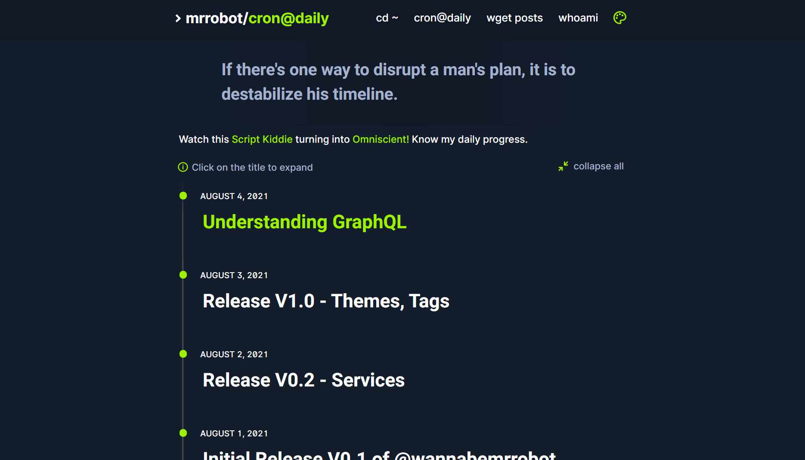
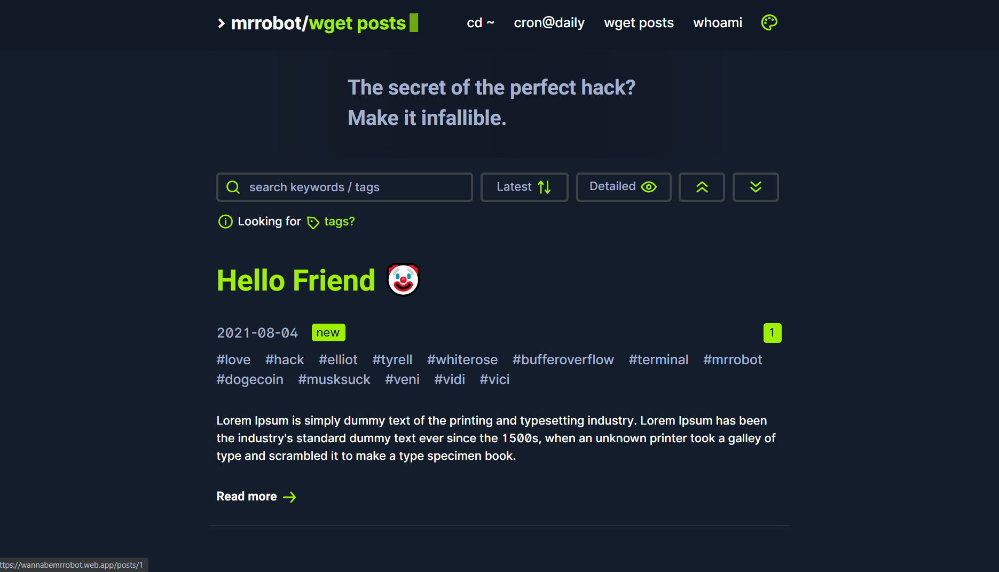
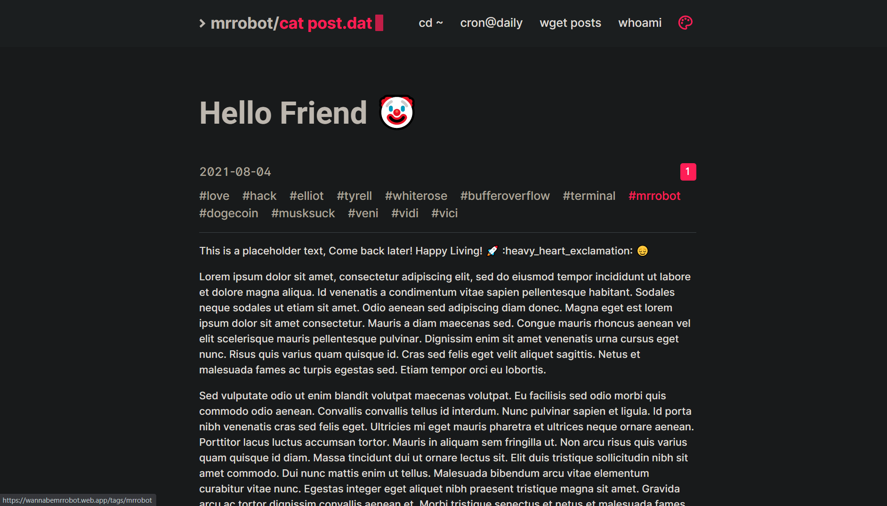
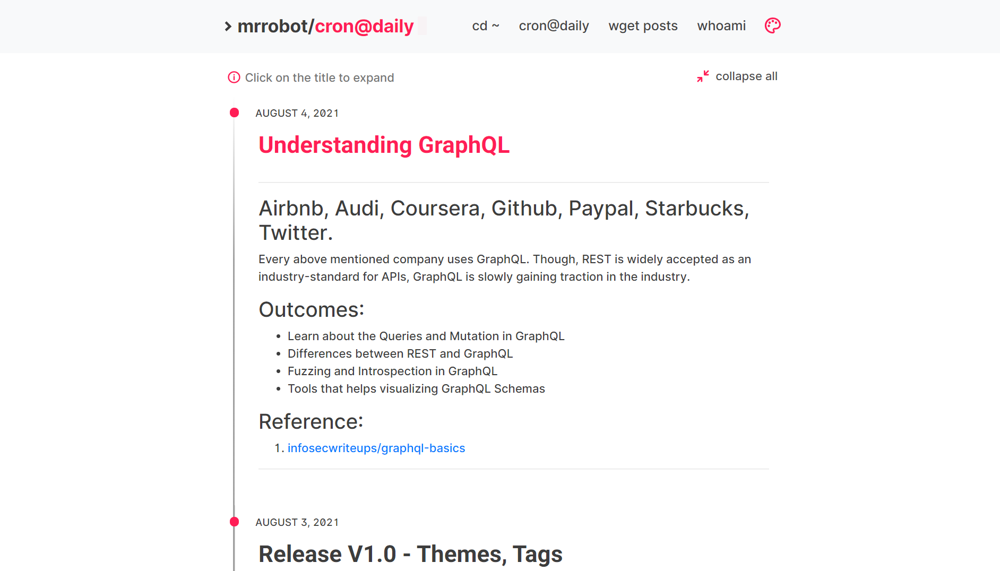

# @wannabemrrobot

### Repository that contains contents for the blog and timeline in [@wannabemrrobot](www.wannabemrrobot.web.app)

## [cron@daily](./cron@daily/)
This folder contains markdowns corresponding to every day progress details of me. The [webapp](www.wannabemrrobot.web.app/crondaily) fetches the [timeline.json](./timeline.json) and iterates over it to display the details in a timeline view.

## [posts](./posts/)
This folder has files that are primarily markdown and contains the contents of the posts on the [blog](www.wannabemrrobot.web.app/posts). The [app](www.wannabemrrobot.web.app/posts) fetches the [posts.json](./posts.json) to get a list of posts objects which then contains the url of the actual blog post.

## [themes](./themes/)
Themes folder contains [theme].jsons which has CSS variables for the styling of the [webapp](www.wannabemrrobot.web.app). These json files are fetched by iterating through the [themelist.json](./themelist.json) which then is used to change the app theme at runtime.

